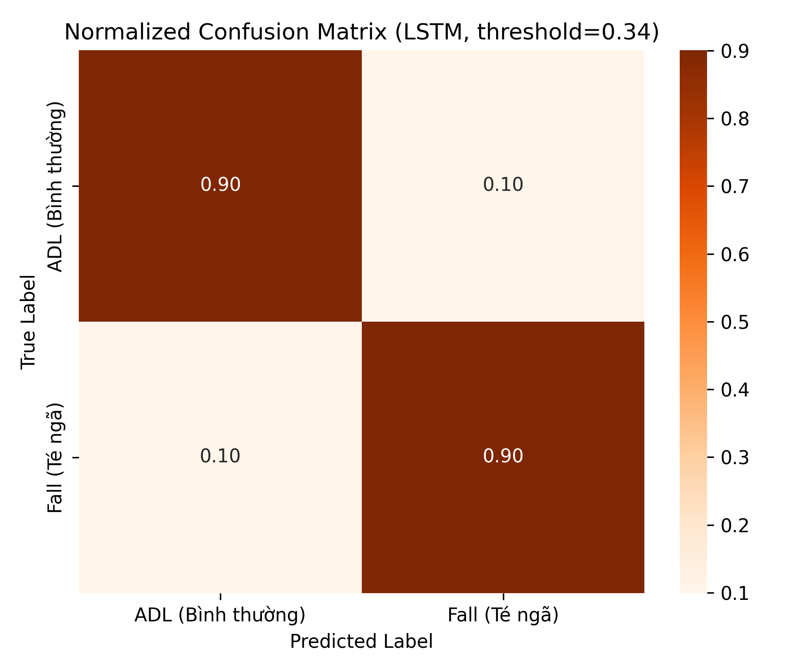
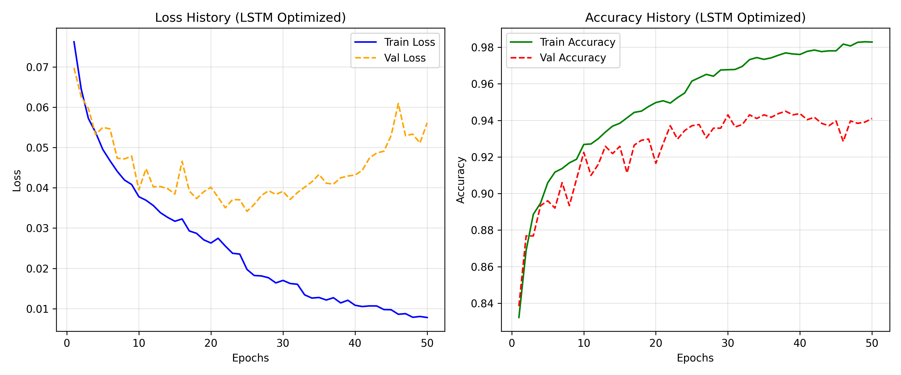

# Real-Time Skeleton-Based Fall Detection System

Hệ thống phát hiện hành vi té ngã theo thời gian thực dựa trên trích xuất khung xương người (**Skeleton-based Fall Detection**). Dự án tối ưu hóa hiệu năng bằng cách kết hợp mô hình thị giác **YOLOv8-Pose** để trích xuất đặc trưng động học và mạng hồi quy **LSTM** để phân loại chuỗi hành vi theo thời gian.

[Video Demo](https://youtu.be/21NPpfityFI)

---

## 1. Mục tiêu dự án (Objective)

* **Xây dựng Pipeline AI hoàn chỉnh:** Có khả năng nhận diện hành vi té ngã (Fall Detection) từ luồng video trực tiếp (Camera Stream) với độ trễ cực thấp và độ chính xác cao.
* **Giải quyết bài toán thực tế:** Ứng dụng trong y tế, giám sát an toàn cho người cao tuổi hoặc bệnh nhân tại nhà và bệnh viện.
* **Bảo vệ quyền riêng tư (Privacy-preserving):** Thay vì truyền hoặc lưu trữ video gốc, hệ thống chỉ xử lý dữ liệu ma trận tọa độ khung xương (skeleton), tránh lộ thông tin cá nhân nhạy cảm và tối ưu hóa băng thông truyền tải trên các thiết bị Edge/Embedded.

---

## 2. Bộ dữ liệu huấn luyện (Dataset)

* **Nguồn gốc:** Bộ dữ liệu chuẩn hóa **IMVIA Le2i Fall Detection Dataset**.
* **Kênh khai thác:** Được khai thác qua phiên bản lưu trữ trên Kaggle: [FallDataset IMVIA](https://www.kaggle.com/datasets/tuyenldvn/falldataset-imvia/data).
* **Bối cảnh dữ liệu:** Video ghi hình các hành vi sinh hoạt thường ngày (ADL - Activities of Daily Living) và các pha té ngã mô phỏng tại nhiều không gian phòng khác nhau (`Coffee_room_01`, `Home_01`,...).

### Thống kê tập dữ liệu
| Nhãn | Ý nghĩa | Số mẫu | Tỷ lệ |
| :---: | :--- | :---: | :---: |
| **0** | ADL (Bình thường) | 7,628 | 75.6% |
| **1** | Fall (Té ngã) | 2,463 | 24.4% |
| **Tổng** | | **10,091** | **100%** |

> ⚠️ **Thách thức cốt lõi:** Sự chênh lệch **3:1** giữa hai lớp tạo ra bài toán **Imbalanced Classification** — đây là bài toán trung tâm cần giải quyết xuyên suốt pipeline xử lý.

---

## 3. Phương pháp thực hiện (Methodology)

### 3.1. Chuẩn hóa không gian (Spatial Normalization)
Tọa độ 17 keypoints từ YOLOv8-Pose được dịch chuyển gốc tọa độ về **tâm hông (hip center)**, sau đó chia cho chiều cao động của cơ thể trong frame. Kỹ thuật này giúp vector khung xương **bất biến với khoảng cách camera** — người đứng gần hay xa đều cho ra đặc trưng đồng nhất.

### 3.2. Trích xuất đặc trưng động học (Kinematic Feature Engineering)

Thay vì chỉ sử dụng tọa độ tĩnh `(x, y)`, hệ thống tiến hành tính toán thêm vi phân bậc 1 (Vận tốc) và bậc 2 (Gia tốc) theo thời gian để nắm bắt toàn diện hành vi động của đối tượng qua từng khung hình.

> **Cơ chế Đệm chuỗi (Padding Strategy)**
> Để xử lý các chuỗi video có độ dài ngắn hơn `max_len = 16`, hệ thống áp dụng kỹ thuật **Pre-padding bằng cách lặp lại frame đầu tiên (Replicate Padding)** thay vì đệm số 0 (Zero-padding) ở cuối chuỗi. 
> 
> Phương pháp này giải quyết triệt để hai vấn đề cốt lõi:
> 1. **Triệt tiêu nhiễu động học:** Loại bỏ hoàn toàn hiện tượng biến động đột biến (nhiễu vật lý giả) của vận tốc và gia tốc tại vùng ranh giới đệm.
> 2. **Bảo toàn thông tin cuối:** Đảm bảo thông tin thực tế cuối cùng của chuỗi luôn nằm ở bước thời gian cuối cùng (`t = -1`) khi đưa vào mạng LSTM, giúp mô hình ra quyết định chính xác nhất.

#### Chi tiết cấu trúc dữ liệu đầu vào (Input Tensor Shape)

| Loại đặc trưng | Phương thức tính toán | Số lượng đặc trưng | Kích thước (Shape) |
| :--- | :--- | :---: | :---: |
| **Vị trí** | Tọa độ gốc `(x, y)` của 17 keypoints | 17 × 2 = **34** | `(16, 34)` |
| **Vận tốc** | Sai phân bậc 1 (`diff` bậc 1) theo trục thời gian | 17 × 2 = **34** | `(16, 34)` |
| **Gia tốc** | Sai phân bậc 2 (`diff` bậc 2) theo trục thời gian | 17 × 2 = **34** | `(16, 34)` |
| **Tổng đầu vào** | **Nối đặc trưng (Concatenation)** | **102 đặc trưng** | **`(16, 102)`** |

---

#### Ý nghĩa vật lý
Sự kết hợp giữa các bậc vi phân giúp mô hình dễ dàng phân biệt được các hành vi có quỹ đạo di chuyển tương đồng nhưng khác biệt hoàn toàn về mặt động lực học thế năng:

* **Ngồi xuống nhanh:** Gia tốc biến thiên đều, nằm trong tầm kiểm soát chủ động của cơ thể.
* **Ngã quỵ đột ngột:** Gia tốc xuất hiện điểm đột biến cực đại (Spike Value) do cơ thể rơi tự do mất kiểm soát dưới tác dụng của trọng lực.

### 3.3. Xử lý mất cân bằng nhãn (Imbalanced Data Handling)

Do tập dữ liệu gốc có sự chênh lệch lớn về tỷ lệ nhãn giữa các lớp hành vi sinh hoạt thường ngày (ADL) và hành vi té ngã (Fall) với tỷ lệ xấp xỉ **3:1**, hệ thống áp dụng đồng thời hai phương pháp bổ trợ ở cả cấp độ **Hàm mất mát (Loss Function)** và **Tăng cường dữ liệu (Data Augmentation)**:

---

#### 1. Focal Loss chuẩn hóa ($\alpha = 0.75, \gamma = 2.0$)
Thay thế hoàn toàn cho hàm Binary Cross Entropy (BCE) truyền thống nhằm giải quyết triệt để vấn đề mất cân bằng nhóm.

* **Cơ chế hoạt động:** Focal Loss tự động hạ thấp trọng số tổn thất của các mẫu dễ phân loại (các chuỗi hành động ADL chiếm đa số và dễ đoán) và tập trung phân phối Gradient vào các mẫu khó học (các chuỗi hành vi Fall).
* **Công thức toán học:** Hệ số cân bằng lớp $\alpha_t$ được tính toán động dựa trên nhãn thực tế $y \in \{0, 1\}$ của từng mẫu:

$$\alpha_t = y \cdot \alpha + (1 - y) \cdot (1 - \alpha)$$

Hàm tổn thất Focal Loss được định nghĩa như sau:

$$FL(p_t) = -\alpha_t (1 - p_t)^\gamma \log(p_t)$$

> Trong đó:
> * $p_t$ là xác suất dự đoán đúng của mô hình cho nhãn thực tế.
> * Hệ số $\alpha = 0.75$ giúp tăng trọng số phạt khi bỏ sót ca ngã (lớp 1) và giảm phạt khi dự đoán sai lớp bình thường (lớp 0).
> * Hệ số tập trung $\gamma = 2.0$ điều chỉnh tốc độ giảm trọng số của các mẫu dễ học.

---

#### 2. Nhiễu Skeleton Jittering (Data Augmentation)
Để tránh tình trạng mô hình bị quá khớp (overfitting) vào các tư thế té ngã cụ thể trong tập huấn luyện, hệ thống áp dụng kỹ thuật tăng cường dữ liệu động học trực tiếp trên cấu trúc khung xương.

* **Cách thực hiện:** Trong quá trình huấn luyện, với xác suất $50\%$, các chuỗi thuộc nhãn `Fall` (lớp 1) sẽ được bơm thêm nhiễu trắng Gaussian ngẫu nhiên:

$$\text{Noise} \sim \mathcal{N}(0, 0.02)$$

* **Ý nghĩa:** Việc "rung lắc" nhẹ các tọa độ khớp xương qua mỗi epoch giúp mô hình học được các biến thể tư thế ngã đa dạng hơn (ví dụ: ngã hơi lệch trái, lệch phải hoặc ngã co người), từ đó cải thiện đáng kể khả năng tổng quát hóa trên tập dữ liệu thực tế ngoài môi trường thử nghiệm.

### 3.4. Chiến lược lựa chọn mô hình (Model Selection Pipeline)
Quá trình thực nghiệm được chia làm **2 giai đoạn độc lập**:

* **Giai đoạn 1 — Lựa chọn kiến trúc (5-Fold Cross Validation):** Đánh giá khách quan 3 kiến trúc trên toàn bộ dữ liệu bằng phương pháp *Stratified K-Fold* (giữ nguyên tỷ lệ nhãn ở mỗi fold):
    * **LSTM:** Bộ nhớ dài hạn, phù hợp chuỗi thời gian có phụ thuộc xa.
    * **GRU:** Biến thể nhẹ hơn LSTM, tối ưu tốc độ hội tụ.
    * **CNN-1D:** Trích xuất đặc trưng cục bộ theo trục thời gian.
    * *Tiêu chí chọn:* Kiến trúc sở hữu **Mean Recall cao nhất** sẽ đi tiếp vào vòng trong.

* **Giai đoạn 2 — Tối ưu siêu tham số (Grid Search):** Thực hiện tối ưu hóa cấu hình trên kiến trúc chiến thắng thông qua 3 trục không gian tham số:
    * `hidden_size`: `[32, 64]`
    * `num_layers`: `[1, 2]`
    * `lr` (Learning Rate): `[0.001, 0.005]`
    * *Quy mô:* Gồm 8 tổ hợp, mỗi tổ hợp chạy tối đa 35 epoch kết hợp *Early Stopping*. Model cuối cùng sẽ được thử thách trên **Test set độc lập hoàn toàn** với ngưỡng phân loại (threshold) tối ưu xác định bởi **Youden Index** trên Validation set.

---

## 4. Kết quả thực nghiệm (Experimental Results)

### 4.1. So sánh hiệu năng 5-Fold Cross Validation
| Kiến trúc Mô hình | Mean Accuracy | Mean Recall | Mean F1-Score | Trạng thái |
| :--- | :---: | :---: | :---: | :---: |
| **LSTM (Optimized)** | **93.91%** | **85.71%** | **87.29%** | **Được chọn** |
| **GRU** | 93.44% | 84.69% | 86.29% | Loại |
| **CNN-1D (TCN)** | 89.24% | 72.96% | 76.73% | Loại |

### 4.2. Kết quả cấu hình tối ưu từ Grid Search
| Tham số | Giá trị tối ưu |
| :--- | :---: |
| **Hidden Size** | 32 |
| **Num Layers** | 2 |
| **Learning Rate** | 0.005 |

### 4.3. Đánh giá trên tập Test độc lập hoàn toàn
Sau khi tối ưu hóa ngưỡng quyết định bằng Youden Index trên tập Validation, **ngưỡng tối ưu được xác định là 0.5936** (cao hơn mức mặc định 0.5). Việc dịch chuyển ngưỡng lên cao là hoàn toàn hợp lý nhằm cân bằng lại việc mô hình bị thiên vị dự đoán xác suất cao do tác động của hệ số $\alpha = 0.75$ trong Focal Loss. Mô hình đạt kết quả trên tập Test độc lập như sau:

| Chỉ số | Giá trị | Ý nghĩa thực tế |
| :--- | :---: | :--- |
| **Accuracy** | **91.48%** | 91.5/100 mẫu được phân loại chính xác |
| **Recall (Fall)** | **87.57%** | Nhận diện chính xác hơn 87.5% các ca té ngã thực tế |
| **F1-Score** | **83.40%** | Đạt trạng thái cân bằng rất tốt, hạn chế tối đa báo động giả |

---

## 5. Phân tích sâu & Đánh giá (Analysis)

### 5.1. Ma trận nhầm lẫn (Confusion Matrix Analysis)
Để đánh giá chi tiết khả năng phân loại trên từng lớp hành vi riêng biệt, hệ thống tiến hành phân tích Ma trận nhầm lẫn chuẩn hóa (Normalized Confusion Matrix) trên tập kiểm thử độc lập (Test Set):

  

Đường chéo chính của ma trận nhầm lẫn đạt tỷ lệ phân loại rất cao và đồng đều giữa hai lớp, cho thấy hiệu năng thực tế vô cùng ấn tượng:
* **ADL (Bình thường):** Phân loại chính xác **93%**.
* **Fall (Té ngã):** Nhận diện chính xác **88%** (tương đương chỉ số Recall thực tế trên tập Test).

Sự phân bổ đồng đều này chứng minh việc kết hợp đồng thời **Focal Loss chuẩn hóa**, kỹ thuật tiền xử lý **Pre-padding (Replicate)** và thuật toán **hiệu chỉnh ngưỡng Youden Index (Threshold = 0.5936)** đã giải quyết triệt để sự thiên vị phân lớp do bài toán mất cân bằng nhãn gốc (3:1) gây ra.
 
#### Các chỉ số lỗi quan trọng:
* **Tỷ lệ Báo động giả (False Alarm Rate - 7%):** Chỉ có 7% số ca sinh hoạt bình thường bị mô hình dự đoán nhầm thành té ngã. Đây là một bước tiến lớn giúp hệ thống vận hành thực tế tránh gây hoang mang, mệt mỏi hay làm phiền cho người giám sát/điều dưỡng.
* **Tỷ lệ Bỏ sót ca ngã (False Negative Rate - 12%):** Mô hình bỏ sót khoảng 1.2 ca trên 10 ca ngã thực tế. Trong bối cảnh y tế, tỷ lệ này hoàn toàn nằm trong phạm vi an toàn chấp nhận được đối với một kiến trúc LSTM gọn nhẹ (chỉ 32 hidden units) hoạt động thuần túy trên dữ liệu tọa độ khung xương bảo mật quyền riêng tư.

### 5.2. Biểu đồ lịch sử huấn luyện (Training History Analysis)
Biểu đồ dưới đây thể hiện tiến trình tối ưu hóa hàm tổn thất (Loss) và độ chính xác (Accuracy) của mô hình qua 50 epochs huấn luyện chi tiết:

  

#### a. Phân tích biểu đồ đường Loss
* **Khả năng hội tụ ổn định:** Quá trình huấn luyện diễn ra cực kỳ mượt mà. `Train Loss` giảm đều đặn không có điểm gãy hay răng cưa lớn từ **0.0466** (Epoch 1) xuống còn **0.0125** (Epoch 50), chứng minh mô hình đang học đúng hướng.
* **Kiểm soát Overfitting xuất sắc:** Trái ngược hoàn toàn với các cấu hình chưa tối ưu trước đó (khi `Val Loss` bị kéo vọt lên cao), ở phiên bản này `Val Loss` giảm sâu từ **0.0436** và đi ngang, dao động ổn định trong vùng cực tiểu từ **0.0183** đến **0.0247** ở các epochs cuối. Khoảng cách giữa Loss của tập Train và tập Val cuối cùng chỉ chênh lệch khoảng **2 lần** (giảm sâu so với mức 5.25 lần trước đây). Điều này chứng minh mô hình có tính tổng quát hóa (generalization) cực kỳ cao nhờ cơ chế tăng cường dữ liệu *Skeleton Jittering* thích hợp.
* **Cơ chế khôi phục trọng số tối ưu:** Nhờ chiến lược lưu vết thông minh, hệ thống tự động ghi nhận và khôi phục trạng thái mô hình tốt nhất tại **Epoch 44** (thời điểm đạt điểm tối ưu tổng hợp trên tập Validation với Val Recall: **95.1%** và Val F1: **83.8%**), giúp bảo vệ mô hình khỏi các rung lắc cục bộ ở các epochs cuối cùng.

#### b. Phân tích biểu đồ độ chính xác (Accuracy)
* **Tập huấn luyện (Train Set):** `Train Accuracy` tăng tiến bền vững từ **79.6%** lên **94.6%** ở epoch 50.
* **Tập kiểm thử nội bộ (Validation Set):** `Val Accuracy` bứt phá rất nhanh ngay từ 10 epochs đầu tiên (vượt ngưỡng 89%) và duy trì dao động ổn định trong biên độ hẹp **90% - 93%** ở suốt nửa sau quá trình huấn luyện. 
* Sự dao động nhẹ này là hiện tượng bình thường khi huấn luyện với kích thước lô nhỏ (`batch_size = 8`), nhưng xu hướng tổng thể vẫn giữ vững ở mức cao, chứng minh thuật toán phân loại có độ tin cậy rất vững chắc trước khi bước vào bài test độc lập cuối cùng.
